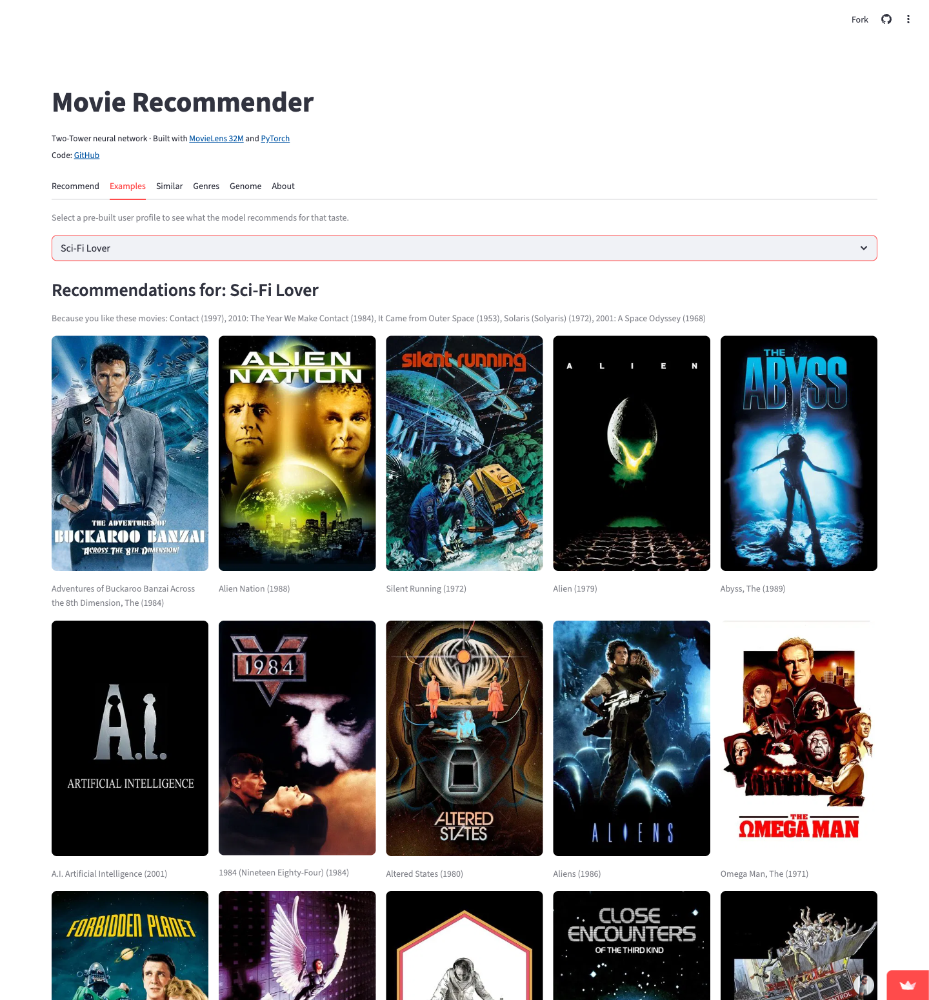
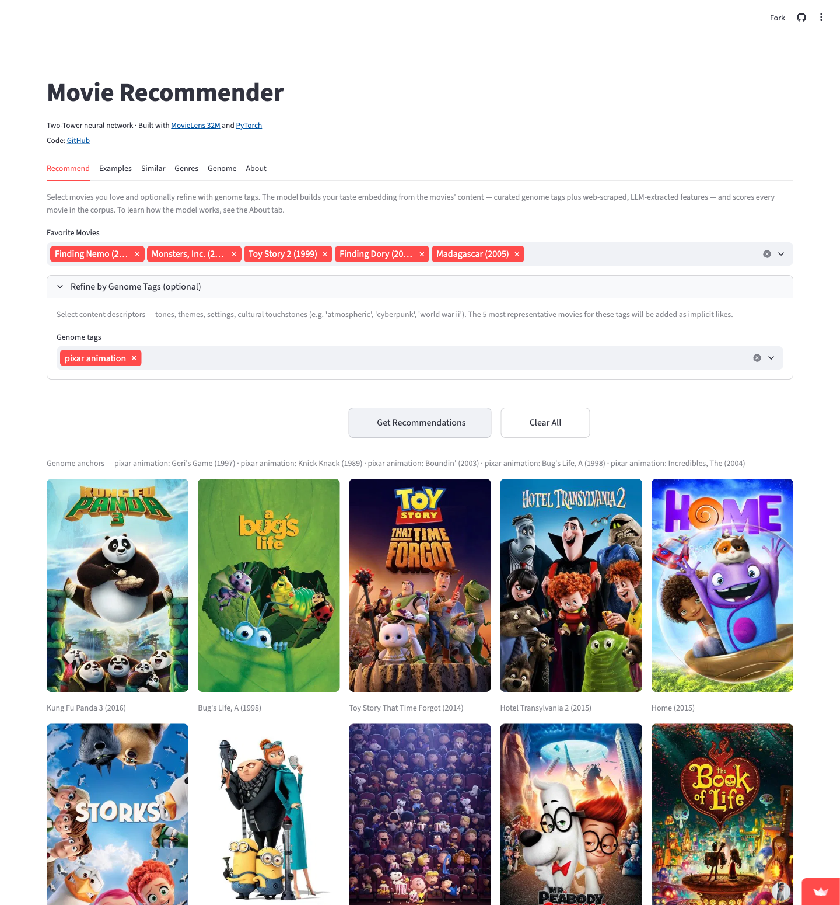

# 🎬 Movie Recommender — PyTorch Two-Tower Neural Network

> A deep two-tower recommender trained on **MovieLens 32M** that recommends movies to **any** user — including ones it has never seen — from nothing but a handful of films they like.

[](https://movie-recommender-system-two-tower-model.streamlit.app/)
[](https://pytorch.org)
[](https://www.python.org)
[](https://grouplens.org/datasets/movielens/32m/)
[](LICENSE)

### 👉 **[Try the live demo](https://movie-recommender-system-two-tower-model.streamlit.app/)**

<p align="center">
  
</p>

<p align="center"><em>Tell it you love <strong>2001</strong>, <strong>Solaris</strong>, and <strong>Contact</strong> → it returns deep-cut classics (Stalker, Forbidden Planet, Soylent Green), not the IMDb Top 10.</em></p>

---

## Why this project is different

Almost every recommender tutorial — and most production systems — give each user a **learned ID embedding**. That works, but it has a hard limitation: **you can only recommend to users the model was trained on.** A brand-new user has no embedding, so you're stuck retraining, fine-tuning, or faking it with a "similar user" proxy.

**This model has no user-ID embedding at all.** A user is represented purely as a function of their *taste signals* — the movies they've watched, what they liked vs. disliked, their genre affinities, and the semantic "texture" of their history. The network learns to embed **features of the user, not the user's identity.**

The payoff: the same frozen model serves recommendations for *anyone* — including the visitor poking at the live demo right now, who didn't exist when the model was trained. **No retraining. No user-level cold-start.** Give it three movies you like and it builds your taste vector on the fly.

## ✨ Highlights

- 🧊 **Cold-start-free by design** — no user-ID lookup; new users are embedded from a few liked movies at inference time.
- 🏗️ **Two-tower architecture** — separate user & item towers project into a shared 128-dim space; recommendation = cosine similarity. Item embeddings are precomputed once, so scoring the whole catalog is a single matrix multiply.
- 🧮 **Full-softmax training** with **logit-adjusted popularity correction** ([Menon et al., ICLR 2021](https://arxiv.org/abs/2007.07314)) — **8.7× higher MRR** than the MSE baseline, with popular blockbusters surfacing *only when relevant*.
- 🧬 **Two content fingerprints per movie, fused in the item tower:** the dataset's **1,128 curated genome tags** *and* **132 features I built myself** — web-scraped from TMDB + Wikipedia and scored 0–1 by an LLM.
- 💰 **A cost lesson, in a side experiment**: I also put those self-built LLM features head-to-head against MovieLens's premium hand-curated genome tags — a one-day, ~$0 pipeline vs. fifteen years of community data. ([see the deep-dive →](#-200-vs-200k-item-content-features-with-an-llm-instead-of-hand-labeled-tagging))
- 🚀 **Live, interactive Streamlit app** with poster grids, pre-built taste personas, "similar movies," and an embedding-space explorer.
- 🍏 **Apple Silicon (MPS) accelerated** training/eval (~145 it/s), with device-agnostic CPU export for cloud serving.

---

## 🧠 How it works

### Two-tower architecture

Both towers consume different inputs but emit an **L2-normalized 128-dim vector**. Because both are unit-norm, their dot product *is* cosine similarity — so a single `user · item` product ranks the whole corpus.

```
USER TOWER (no user ID — built from taste signals)
  sum_pool(item_emb[full history])            → pool_full      (32)  ┐
  sum_pool(item_emb[liked history])           → pool_liked     (32)  │ 4 history pools,
  sum_pool(item_emb[disliked history])        → pool_disliked  (32)  │ shared item-ID table
  rating_weighted_sum(item_emb[history])      → pool_weighted  (32)  ┘
  user_genome_tower(avg genome over history)  → genome_ctx     (32)
  user_llm_tower(avg LLM feats over history)  → llm_ctx        (32)
  user_genre_tower(per-genre affinity)        → genre_emb      (32)
  timestamp_tower(watch month)                → ts_emb          (4)
        concat(228) → Linear(256) → ReLU → Linear(128) → L2-norm → user_emb (128)

ITEM TOWER
  item_embedding_tower(movie_id)              → item_id_emb    (32)  ← shared with user pools
  item_genome_tag_tower(1,128 genome scores)  → genome_emb     (32)
  item_llm_feature_tower(132 LLM features)    → llm_emb        (32)
  item_genre_tower(genre one-hot)             → genre_emb       (8)
  item_tag_tower(user-applied tags)           → tag_emb        (16)
  year_embedding_tower(release year)          → year_emb        (8)
        concat(128) → Linear(256) → ReLU → Linear(128) → L2-norm → item_emb (128)

SCORE = dot(user_emb, item_emb)   # = cosine similarity (both unit-norm)
```

**The shared item-ID embedding is the key trick.** The same 32-dim table embeds the *target movie's* identity **and** pools the user's watch history (full / liked / disliked / rating-weighted). This forces user history and item identity into the *same* space — a movie you liked pulls your user vector straight toward that movie; a disliked movie pushes it away.

### Content fingerprints: curated *and* self-built

The item tower describes each movie from several content signals. Two are **rich, dense semantic fingerprints**:

| Source | Dims | Origin |
|---|---|---|
| **Genome tags** | 1,128 | Ships with MovieLens — ML-derived relevance scores per (movie, tag). |
| **LLM features** | 132 | **Built end-to-end in this repo** — scraped from TMDB + Wikipedia, then scored 0–1 by an LLM across six groups: themes & plot (32), tone & mood (26), setting/era/sub-genre (32), provenance & structure (24), reception & prestige (11), visual medium (7). |

The item tower also folds in three lighter content signals: **genre** (20-way one-hot), **user-applied tags** (306 community tags — present, but far sparser and noisier than the genome scores), and **release year**.

The deployed model fuses **both** rich fingerprints (`FEATURE_TOWERS=both`) for maximum feature robustness. The self-built LLM pipeline (scrape → LLM-extract → tensor) lives in [`llm_features/`](llm_features/) — and is put head-to-head against the curated genome in [a dedicated experiment](#-200-vs-200k-item-content-features-with-an-llm-instead-of-hand-labeled-tagging) below.

### Popularity-bias correction (Menon et al., 2021)

Full softmax has a structural bias: popular movies appear in *every* batch as hard negatives **and** as frequent positives, which drags their embeddings toward the "average" user — making them look relevant to everyone. The fix is the **logit-adjusted loss**: add `α · log(interaction_count)` to each item's logit *during training only*. Popular items get a free score boost, so the model no longer needs to inflate their embeddings to win — and they shrink back to where they belong. At inference, scoring uses **raw dot products** (no post-hoc correction).

`α = 0.5` is the deployed setting — the sweet spot where genre discrimination stays sharp and blockbusters surface only when they actually fit the taste.

### Training at a glance

| | |
|---|---|
| **Dataset** | MovieLens 32M — ~33M ratings, ~200K users, ~86K movies |
| **Corpus** | movies with 200+ ratings (~9,375) · users with 20–500 ratings |
| **Loss** | full softmax cross-entropy over all corpus items + Menon logit adjustment |
| **Optimizer** | Adam, lr=1e-3, batch=512, temperature=0.1, 150K steps |
| **Split** | user-level 90/10 — no user appears in both train and val |
| **Protocol** | *rollback* — for each watch event, context = all prior watches, target = the next watch |
| **Output** | unit-norm 128-dim embeddings; cosine-similarity ranking |

---

## 📊 Results

**The modeling win.** Switching from an MSE rating-regression baseline to full-softmax retrieval with popularity correction is dramatic — **~8.7× MRR** and ~8× Hit Rate@10:

| Metric | MSE baseline | **Two-Tower Softmax (α=0.5)** |
|---|---|---|
| Hit Rate@1 | 0.43% | **5.99%** |
| Hit Rate@5 | 1.68% | **15.49%** |
| Hit Rate@10 | 2.70% | **22.06%** |
| Hit Rate@20 | 4.26% | **30.44%** |
| Hit Rate@50 | 7.36% | **44.38%** |
| **MRR** | 0.0133 | **0.1153** |

<sub>Held-out *rollback* eval: for each held-out user, context = prior watches, target = next watch.</sub>

---

## 🕹️ The app

Pick a few movies you love and the model builds your taste vector and ranks the whole catalog — live:

<p align="center">
  
</p>

The [Streamlit app](https://movie-recommender-system-two-tower-model.streamlit.app/) has six tabs:

- **Recommend** — pick your favorite movies (and optionally nudge with genome tags) → ranked poster grid.
- **Examples** — pre-built taste personas (Sci-Fi, Horror, Comedy, Heist, …) to see the model's range instantly.
- **Similar** — nearest neighbors of any movie in the 128-dim embedding space.
- **Genres** / **Genome** — probe what the *item tower* learned about genres and genome tags.
- **About** — the full architecture, training, and popularity-correction write-up.

---

## 🚀 Quickstart

### Run the app locally

The trained, exported model lives in [`serving/`](serving/) and is committed — so the app runs with **no training and no dataset download**:

```bash
pip install -r requirements.txt
streamlit run streamlit_app.py
```

### Reproduce the model from scratch

Download [MovieLens 32M](https://grouplens.org/datasets/movielens/32m/) into `data/ml-32m/`, then run the pipeline. Stages 1–3 cache to disk, so you only re-run what changed.

```bash
python main.py preprocess   # raw CSVs        → base parquets
python main.py features     # base parquets   → engineered features
python main.py dataset      # features        → training tensors
python main.py train        # full-softmax training (canonical)
python main.py eval         # Recall@K, NDCG@K, Hit Rate@K, MRR
python main.py canary       # sanity-check recs for taste personas
python main.py export       # write serving/ artifacts for the app
```

<details>
<summary><strong>CLI reference</strong></summary>

```bash
# Most commands accept an optional checkpoint path (defaults to the most recent):
python main.py eval   saved_models/<checkpoint>.pth
python main.py canary saved_models/<checkpoint>.pth
python main.py probe  saved_models/<checkpoint>.pth      # genre / tag / genome embedding probes
python main.py export saved_models/<checkpoint>.pth

# Fetch TMDB poster URLs used by the app (run once; resumable):
TMDB_API_KEY=your_key python main.py posters
```

The self-built LLM-feature pipeline (scrape → schema → extract → merge → tensor) lives in [`llm_features/`](llm_features/).
</details>

---

## 🔬 $200 vs $200k: Item Content Features With an LLM Instead of Hand-Labeled Tagging

*A controlled experiment, layered on top of the deployed model: can an LLM replace a premium hand-curated feature set — one built in a day instead of accreted over fifteen years?*

Every recommender wants a dense **content vector** per item — a descriptor of what each movie *is*, independent of who watched it (it's what carries the long tail and brand-new items). MovieLens ships a gold-standard one: the **genome tags**, 1,128 relevance scores per movie, reverse-engineered by GroupLens from a volunteer tag survey on top of a **fifteen-year, platform-scale community folksonomy**, run through a dedicated ML pipeline. A new company has none of that — so I asked the practical question: **can you bootstrap a comparable content vector from nothing but an item's public web text + an LLM, in about a day?**

**The cheap pipeline.** For every movie I scraped TMDB (overview, cast, director, keywords) and the Wikipedia plot, then ran **six grouped structured-output LLM calls** — themes, tone, setting/era, provenance, factual reception, visual medium — each enforced by a JSON schema. The whole ~9,375-movie corpus was scraped and extracted in **about a day**, fanned out in parallel at near-zero marginal cost. (Pipeline: [`llm_features/`](llm_features/).)

**The setup.** I dropped those 132 LLM features into the content slot of otherwise-identical models — deliberately scored on genome's *own* tag axes, to handicap the LLM, not flatter it — and compared three arms: genome (**A**), LLM (**B**), and a no-content floor (**C**), all at α=0, over **382,138 rollbacks** (all 19,134 val users), replicated on a second corpus. The catch is *where* you run it.

### The setting that matters: a new team's day-one model

Strip the model down to what most real (implicit-feedback) recommenders actually have — a single watch-history pool + the content slot, and *none* of MovieLens's curated genre, 306 user tags, or release year. There, a content vector earns a real lift over collaborative filtering alone, and the self-built LLM features edge the gold-standard genome — on genome's *own* axes:

| Content slot (stripped, day-one model) | How it's produced | MRR |
|---|---|---|
| **LLM features (self-built)** | scraped web text + an LLM · **~a day, no annotators** | **0.1155** |
| Genome tags (MovieLens) | volunteer survey + 15-yr community folksonomy + ML pipeline | 0.1148 |
| None — pure collaborative-filtering floor | no content tower | 0.1121 |

Both sources clear the floor (genome **+2.4%** MRR, LLM **+3.0%**), and the LLM noses ahead of fifteen years of curated community data. The ordering replicates on a second 4,461-movie corpus.

### The follow-up: add MovieLens's curated metadata back

Restore the curated genre + 306 user tags + year + the rating-derived history pools, and the content lift *vanishes* for both: floor **0.1174** / genome **0.1144** / LLM **0.1176**. Genome even dips *below* the floor — which now carries the curated genre, tags, and year — because it's a **redundant second copy** of metadata the model already has. The tell is what each source loses when you strip that metadata away again: genome loses *nothing* (it just rebuilds the curated genre/tags from its own vectors), the LLM loses a little, the floor loses the most — so **the LLM features are the *less* redundant of the two, the more genuinely additive signal.**

**The takeaway:** in the bare setting most teams actually deploy from, the cheap LLM features match — and slightly edge — the premium genome you'd need a fifteen-year community to build; where you already own a rich curated-metadata stack, an extra content vector is redundant either way. For a new company that's the headline: **don't wait on a tagging pipeline or hire labelers — bootstrap content features from web text + an LLM.**

> *Why the live demo runs the `both` model:* the deployed checkpoint fuses genome + LLM (`FEATURE_TOWERS=both`) for maximum feature robustness — a portfolio-motivated choice, since fusing gave no measurable lift over either source alone. The finding stands on the single-source arms.

**Reproduce it** — the content slot is one env var (identical model otherwise); the stripped "day-one" model adds `BASE_TOWERS=idonly`:

```bash
# rich model (default BASE_TOWERS=all) — A / B / C / deployed D:
FEATURE_TOWERS=genome python main.py train   # A — curated genome tags
FEATURE_TOWERS=llm    python main.py train   # B — self-built LLM features
FEATURE_TOWERS=none   python main.py train   # C — no content tower (floor)
FEATURE_TOWERS=both   python main.py train   # D — both fused (deployed)

# stripped "day-one" model — single history pool, no curated genre/tags/year:
BASE_TOWERS=idonly FEATURE_TOWERS=llm python main.py train   # B′
```

Full write-up — pipeline, mechanism (*why* it works), cost breakdown, and limitations: [**`docs/llm_vs_genome_ablation/llm_vs_genome_ablation.md`**](docs/llm_vs_genome_ablation/llm_vs_genome_ablation.md).

---

## 🗂️ Project structure

```
.
├── main.py                 # CLI entry point — preprocess │ features │ dataset │ train │ eval │ export …
├── streamlit_app.py        # the live demo app
├── src/
│   ├── preprocess.py       # raw MovieLens CSVs → base parquets
│   ├── features.py         # feature engineering (genre affinity, tags, genome, timestamps)
│   ├── dataset.py          # rollback training-example builder (softmax tuples)
│   ├── model.py            # the two-tower MovieRecommender (4-pool user tower, swappable content towers)
│   ├── train.py            # full-softmax training loop + Menon popularity correction
│   ├── evaluate.py         # canary recommendations + embedding probes
│   ├── offline_eval.py     # Recall@K, NDCG@K, Hit Rate@K, MRR
│   ├── inference.py        # build a user vector from a few liked movies → rank the catalog
│   ├── export.py           # bake checkpoint → device-agnostic serving/ artifacts
│   └── checkpoint.py       # config-from-state_dict loader (no separate config file needed)
├── llm_features/           # self-built content pipeline: scrape → LLM-extract → tensor
├── serving/                # exported artifacts the app loads (model, embeddings, feature store, posters)
├── docs/                   # write-ups — the LLM-vs-genome experiment (+ plans/)
└── tests/                  # model shape tests
```

## 🛠️ Tech stack

**PyTorch** (model, training, MPS acceleration) · **Streamlit** (interactive app) · **pandas** / **NumPy** (data pipeline) · **TMDB** + **Wikipedia** (scraped sources for the LLM feature pipeline) · **MovieLens 32M** (training data).

## 📚 Dataset & acknowledgements

- Training data: [MovieLens 32M](https://grouplens.org/datasets/movielens/32m/) by [GroupLens](https://grouplens.org/) (not redistributed here — download separately).
- Popularity correction: Menon et al., [*Long-tail learning via logit adjustment*](https://arxiv.org/abs/2007.07314), ICLR 2021.
- Movie posters via [The Movie Database (TMDB)](https://www.themoviedb.org/).

This is one of a trio of two-tower recommenders I built across domains:
[📚 Books](https://book-recommender-system-two-tower-model.streamlit.app/) ·
[🎮 Games](https://game-recommender-system-two-tower-model.streamlit.app/) ·
🎬 Movies (this repo)

## 📝 License

[MIT](LICENSE) © Nick Greenquist
</content>
