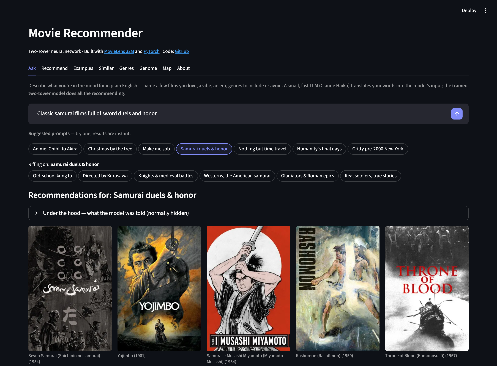
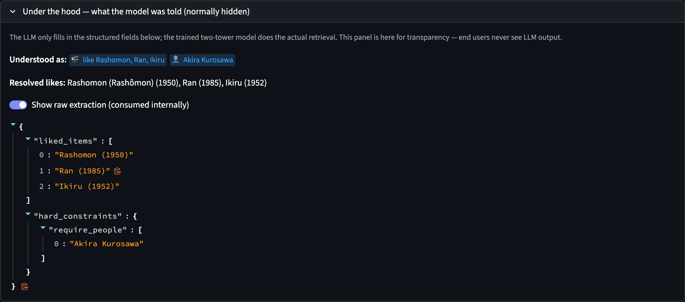

# Building an LLM-Powered Search and Discovery Experience for a Movie Recommender

> **TL;DR:** LLMs are becoming a core part of how industry recommendation systems work: Netflix's natural-language search, Spotify's AI playlists. This project brings that same idea to movies: describe what you want in your own words, and let an LLM translate it into a query a standard recommender retrieval system can serve.

## Background
**Netflix** is beta-testing a natural-language search that turns "something funny and upbeat" into a refinable list of titles. Type more into the same box and it narrows the results further instead of starting over. **Spotify**'s AI playlist tools take a sentence like "science explainers for my morning run" and hand back a generated queue, weighed against your listening history unless you tell it not to. Both use the LLM for the same narrow job: turning what you typed into a query. The recommendation system already in place, not the LLM, decides what you actually see.

## Why Not Just Use an LLM for the Whole Recommendation Problem?

A reasonable objection: why not just ask ChatGPT or Gemini for "movies like Rashomon" directly? Because they already know the answer: frontier LLMs have absorbed IMDb and Letterboxd along with everything else, which makes movies a convenient, checkable showcase, not the general case. A real industrial recommender runs over a catalog the LLM has never seen: proprietary, sized in the millions, too large for any context window. It can't recommend from memory it doesn't have. This architecture (LLM extracts intent, a trained retrieval model that has actually seen the corpus does the matching) is built for that case: the recommendation problem companies actually have, not a toy dataset an LLM already memorized.

### Why Not Fine-Tune Instead?

Fine-tuning an LLM on the catalog doesn't close the gap either. Generative recommenders that decode item names directly have a documented failure mode: hallucinated items that don't exist in the catalog. They're also far more expensive at serving scale: Indeed's fine-tuned GPT-3.5 recommender ran [6.7 seconds per inference](https://eugeneyan.com/writing/recsys-llm/), too slow for online use, and had to be swapped for a lightweight classifier in production. And [Spotify's own generative-retrieval research](https://research.atspotify.com/2024/10/bridging-search-and-recommendation-with-generative-retrieval) found it consistently lagged specialized baselines like SASRec and BERT4Rec: text similarity alone doesn't capture collaborative-filtering signal.

## Why This Helps

This interface solves two different problems. A brand-new user has no history. Most recommenders need weeks of clicks before they're any good, and this project's model was built to skip that: a handful of liked movies is enough, no retraining, no user-ID lookup. But describing "a handful of liked movies" is exactly what a chat box is for. The other problem is the opposite: an existing user who knows what they want, and whose want doesn't match their usual feed. "Something to watch with my nephew this weekend" or "movies like Rashomon but not so bleak" won't surface by scrolling a For You row, and it isn't a search-bar query either. There's no exact title to type. This sits in the middle, between a feed you can't steer and a search bar that only takes exact titles: describe it, get recommendations back.

The business case:

- **Cuts new-user churn.** A good result on day one, no weeks of clicks required.
- **Catches high-intent users search can't serve.** Real intent, no exact title: search dead-ends, Ask doesn't.
- **Explainability comes for free.** The extraction already exists; showing it back costs nothing extra.
- **Handles fuzzy titles and vague intent.** Misspellings, half-remembered titles, "I don't know exactly what I want."
- **Gives users a sense of control.** Steer results directly instead of waiting on the algorithm.

## Design
This project sits a small hosted LLM in front of a trained two-tower movie recommender. Type "classic samurai films full of sword duels and honor," or "movies directed by Akira Kurosawa, like Rashomon, Ran, and Ikiru," and Claude Haiku reads it and fills in one structured object behind the scenes: liked titles, genres, people, mood, hard constraints like year range or rating floor. A deterministic pipeline resolves that structured object into weighted movie anchors and filters, and the trained model does **100%** of the actual retrieval and ranking.

The prompt and resolution logic were tuned against 500 synthetic queries generated to look like what a real user might actually type, on top of my own manual testing along the way. That pass moved the "good board" rate, boards where both an LLM judge and my own manual review agreed the recommendations actually matched the query's intent, from 32.0% to 50.8%.

  

*Click the suggested prompt "Samurai duels & honor" and a board of samurai films renders below (Seven Samurai, Yojimbo, Musashi Miyamoto, Rashomon, Throne of Blood). That click also opens a second row, "Riffing on: Samurai duels & honor," six related pills including "Directed by Kurosawa."*

## LLM as Interpreter, not Recommender
An LLM can't rank a catalog of thousands of movies by itself. There's no reliable scoring against items outside the handful it can name, and no guarantee the titles it recites even exist in the corpus. So this project never asks it to. One design choice worth stating explicitly: **the LLM's own words never reach you, either.** There's no AI-written answer, no chatbot response rendered anywhere. The model's entire job stops at filling in the structured object that just became the results above. A "Show raw extraction" toggle in the app makes this verifiable rather than asserted:

  

*"Under the hood," normally collapsed. `liked_items` resolved to exact titles with years, a nested `hard_constraints.require_people` field carrying the director's name. This is the entire LLM output for the query above, a JSON object rather than a sentence. Nothing here was composed as prose; it's tool-call arguments.*

## Cost

Every live query is one Haiku call: about 12k tokens of system prompt and schema, a short user query, up to 300 tokens back. At Haiku 4.5's list price ($1/M input tokens, $5/M output tokens), a cold call (no cache hit) runs about **$0.017**. A warm call, hitting the 5-minute prompt cache on that 12k-token prefix, drops to about **$0.003**, roughly **6x cheaper**, since a cache read costs a tenth of normal input price against a 1.25x premium to write it. At the rate caps (20 queries per session, 60 per day across all visitors), the worst case (every single call a cache miss) is about **$1/day** for the entire public demo. In practice caching keeps it well under that.

That math changes at real product scale. 10k daily users firing a couple of free-text queries each is 20k live calls a day: **$2k-$10k a month** depending on cache hit rate, not the rounding error it is at demo traffic. The fix is avoiding the call, not shrinking it: semantic caching (GPTCache, Redis LangCache) catches near-duplicate queries and reuses the prior extraction instead of re-calling the model. Mining real query logs to pre-resolve the most common patterns into that same cache, an expanded lookup table rather than a curated set of UI pills, is the other lever.

## What We Learned

A few results were unexpected:

- **Few-shot examples move the needle, new rules don't.** Adding worked examples to the prompt fixed a keyword-routing failure that more instructions couldn't.
- **Extended thinking added nothing.** This is a narrow structured-extraction task, not open-ended reasoning. Forced tool use with thinking off is both cheaper and just as accurate.
- **Haiku is enough.** No frontier model was ever run head-to-head against it here. The case for Haiku is task fit (filling in a schema, not chain-of-thought) plus a roughly 3x cost gap to Sonnet and 5x to Opus (at list price), not a measured win over either.
- **The metadata carries more of the load than the model.** Person, studio, and keyword filters only work because a scraped metadata table exists for the LLM's output to resolve against. Before that table existed, those fields were silently dropped. The LLM is only as good as what it has to point at.
- **Chasing perfect routing isn't the goal, and the gaps are specific rather than vague.** Named titles, directors, genres, and specific themes ("chess," "heist," "time loop") route reliably. Mood-only requests, place names ("movies set in Rome"), and thin niche keywords are the hardest cases: a term that only matches a handful of films corpus-wide will surface all of them regardless of fit, since there's nothing else to rank against.

## More Real Examples

A grab bag of pills, expand for the prompt and the top 5 posters:

<strong>Nothing but time travel</strong>

**Prompt:** "Movies where time travel is the whole point, like Back to the Future and Primer."

    

**Top 5:** Back to the Future Part II (1989), Back to the Future Part III (1990), Frequently Asked Questions About Time Travel (2009), Timecrimes (Cronocrímenes, Los) (2007), Predestination (2014)

<strong>Christmas by the tree</strong>

**Prompt:** "Cozy Christmas movies to watch by the tree."

    

**Top 5:** Elf (2003), A Christmas Story (1983), The Bishop's Wife (1947), Arthur Christmas (2011), How the Grinch Stole Christmas! (1966)

<strong>Gritty pre-2000 New York</strong>

**Prompt:** "Gritty New York City movies from before 2000, no musicals."

    

**Top 5:** The Naked City (1948), The Taking of Pelham One Two Three (1974), The Warriors (1979), Midnight Cowboy (1969), King of New York (1990)

<strong>Studio Ghibli classics</strong>

**Prompt:** "Studio Ghibli movies like Spirited Away and My Neighbor Totoro."

    

**Top 5:** Laputa: Castle in the Sky (Tenkû no shiro Rapyuta) (1986), Nausicaä of the Valley of the Wind (Kaze no tani no Naushika) (1984), Princess Mononoke (Mononoke-hime) (1997), Howl's Moving Castle (Hauru no ugoku shiro) (2004), Kiki's Delivery Service (Majo no takkyûbin) (1989)

<strong>Make me sob</strong>

**Prompt:** "A devastating drama that will absolutely make me sob."

    

**Top 5:** Short Term 12 (2013), Still Alice (2014), Manchester by the Sea (2016), The Good Lie (2014), Wit (2001)

<strong>Full-on zombie apocalypse</strong>

**Prompt:** "Zombie apocalypse movies like 28 Days Later and Dawn of the Dead."

    

**Top 5:** Land of the Dead (2005), Day of the Dead (1985), Undead (2003), 28 Weeks Later (2007), Resident Evil: Apocalypse (2004)

<strong>Old-school kung fu</strong>

**Prompt:** "Classic kung-fu movies like Enter the Dragon and Drunken Master."

    

**Top 5:** The Big Boss (Fists of Fury) (Tang shan da xiong) (1971), Once Upon a Time in China (Wong Fei Hung) (1991), The Way of the Dragon (a.k.a. Return of the Dragon) (Meng long guo jiang) (1972), Fist of Fury (Chinese Connection, The) (Jing wu men) (1972), Once Upon a Time in China III (Wong Fei-hung tsi sam: Siwong tsangba) (1993)

<strong>Stuck in a time loop</strong>

**Prompt:** "Groundhog Day-style time loops, like Edge of Tomorrow."

    

**Top 5:** Source Code (2011), ARQ (2016), Triangle (2009), Before I Fall (2017), Synchronicity (2015)

<strong>Scorsese's New York</strong>

**Prompt:** "Martin Scorsese's New York movies."

    

**Top 5:** New York, New York (1977), After Hours (1985), Taxi Driver (1976), Mean Streets (1973), New York Stories (1989)

<strong>Dogs that break your heart</strong>

**Prompt:** "Emotional dramas about the bond between a person and their dog, like Hachi: A Dog's Story and My Dog Skip. No comedies."

    

**Top 5:** Old Yeller (1957), Umberto D. (1952), Shiloh (1997), Amores Perros (Love's a Bitch) (2000), Wendy and Lucy (2008)

## Try It

**[Try it in the Ask tab of the live demo.](https://movie-recommender-system-two-tower-model.streamlit.app/)** For how it actually works under the hood (the schema, the resolution pipeline, the tradeoffs behind keeping the LLM's output invisible), see the About tab in the app, or the [GitHub README](../../README.md).
