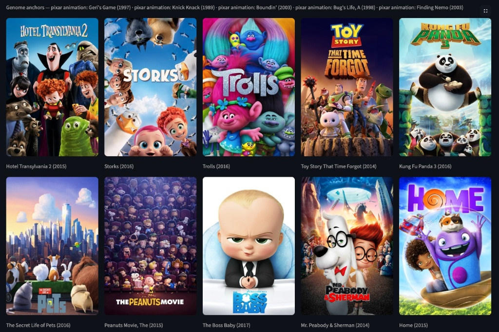
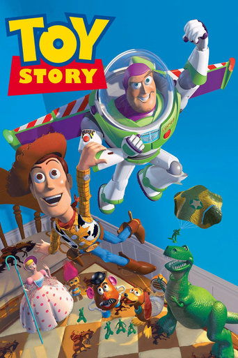
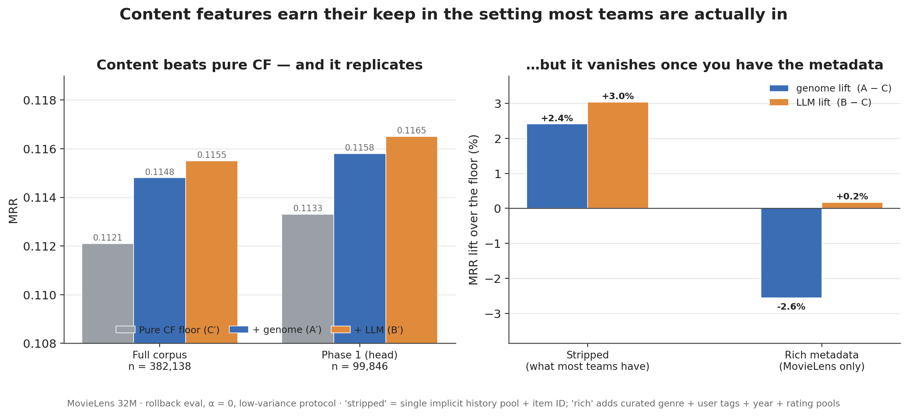
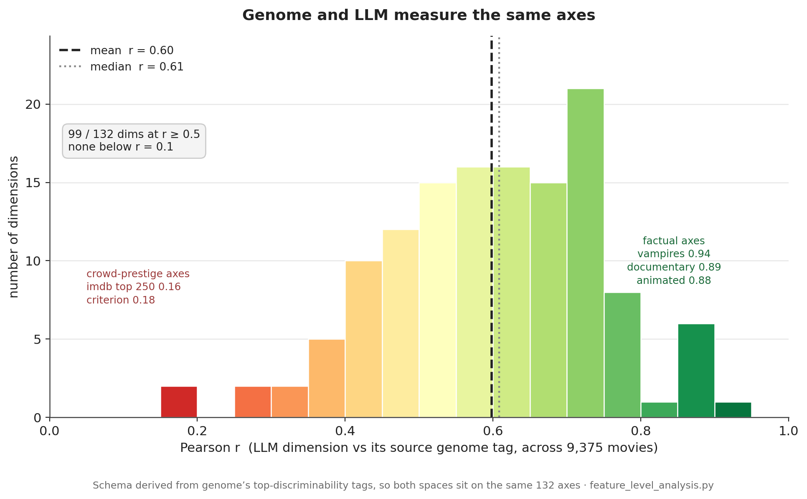

# $200 vs $200k: Item Content Features With an LLM Instead of Hand-Labeled Tagging

*A controlled two-tower recommender experiment on MovieLens 32M — and what it means for a team setting up recommendations with no tagging budget.*

> *A hand-curated tag genome and LLM-extracted features are the same idea one generation apart: turn cheap signals into a dense, per-item content matrix. The first took fifteen years of community data to build; the second needs only an item's public web text — synopsis, cast, plot, scraped and run through an LLM — and built the whole corpus in a day.*

## TL;DR

You're building a recommender with user interactions and each item's text — but no tagging team, and little of the curated metadata a dataset like MovieLens is unusually rich in. So: is a per-item **content vector** worth building, and can you build it cheaply?

MovieLens's gold-standard **tag genome** took fifteen years of community data. The cheap alternative — scrape each item's text, extract features with an LLM — covered all \~9,375 movies in **a day** at near-zero cost. And in that bare setting it **beats a pure-CF floor and edges the genome** on the genome's *own* axes: MRR **0.1155 (LLM) / 0.1148 (genome) / 0.1121 (floor)**. As good as the option you can't afford, and the one you can actually ship.

*The deployed recommender these features power. A user's taste vector is built entirely from movie content — the curated genome tags plus the web-scraped, LLM-extracted features this post compares — with no user-ID embedding.*

## 1. The content-feature problem, and the realistic setting

A two-tower recommender represents each item as an embedding. Collaborative signal — who watched what — carries most of the weight for popular items, but it runs dry exactly where you need help: the long tail, and brand-new items nobody has interacted with yet. That's what a **content vector** is for — a dense, per-item descriptor of what the item *is*, independent of who has touched it. The question is where it comes from.

**Option 1 — the genome.** The MovieLens **tag genome** is the gold standard: a dense matrix of `rel(movie, tag) ∈ [0,1]` — **1,128 tags × 16,376 movies (≈18M scores)** in this project's MovieLens 32M data (9,734 movies in GroupLens's original 2014 release), with every cell populated. But note that **16,376**: it's all GroupLens ever scored — only **\~19% of MovieLens 32M's 87,585 titles**. The genome simply does not exist for the sparser \~71k (a structural limit we return to in the limitations below); it is dense *within* its coverage but covers only the well-tagged head. And the part most people get wrong: it was built **not** by mass human labeling, but from a small **50,203-judgment survey of 676 volunteers** (1–5 scale; a fraction of a percent of the matrix; plus an 85-user pilot), with the rest filled by machine learning (a `glmer` regression, MAE 0.211) over features mined from a **large pre-existing folksonomy** — 186,000 users, 17M ratings, 246,000 tag applications accrued since 1997 — plus crawled IMDb reviews.

**Option 2 — LLM extraction.** Scrape the item's public text (TMDB synopsis, cast, Wikipedia plot) and ask an LLM to score it against a fixed tag taxonomy, with structured (JSON-schema) output. The content vector falls out of the item's own description.

**The setting that frames the whole experiment.** The genome's inputs — a mature folksonomy, crawled reviews, a relevance survey — are exactly what a growing company *doesn't* have. But so is most of the *other* metadata MovieLens ships with: clean, professionally-assigned **genre labels** on every title, and **306 high-frequency user tags** distilled from a massive crowd-tagging effort. A team standing up recommendations for a fresh catalog has none of that. What it reliably has is **interaction logs and an item's public text** — and interactions are usually *implicit* (a click, a watch, a purchase), not the 1–5 explicit ratings MovieLens provides. So the honest question isn't "genome vs LLM in a metadata-rich model." It's: **in the bare setting a real team actually starts from, does a content vector help at all — and is the LLM's good enough to be the one you build?**

## 2. Why it's a fair fight

To compare content *sources* and nothing else, everything else is held fixed: the same two-tower architecture, the same training recipe, and the same evaluation. Only the content slot changes:

- **A — MovieLens genome tags:** the 1,128-dim genome scores fill the content tower.
- **B — LLM feature tags:** 132 LLM-extracted dims fill it instead.
- **C — no content tags:** the content slot is removed — the floor, what the model scores on its history pool and whatever other features are present.

(Throughout, **A / B / C** are the three content arms — genome / LLM / no-content. The primary experiment runs them in a **stripped** model; §6 re-runs them in a metadata-**rich** one.)

One rigor move — a deliberate **handicap on the LLM, not the genome**: the LLM schema is **derived from genome's own top-discriminability tags**, not hand-invented. Both spaces measure the *same axes* — otherwise "LLM ≈ genome" would be unmeasurable — but confining the LLM to genome's taxonomy makes the question the sharpest one there is: *can LLM extraction match the curated genome on the genome's home turf, tag for tag?* The LLM is graded only on axes GroupLens chose, and earns no credit for discriminative patterns it could surface from the scraped text but that genome never tagged. (132 dims, each stored alongside the source genome tag it was derived from.)

This also answers the obvious objection — *"a greenfield team has no taxonomy to extract against."* It doesn't need one: an LLM can **draft** the taxonomy too, clustering recurring themes across thousands of plots. We deliberately didn't, to keep the fight fair. The genome dependency is a self-imposed rule of *this experiment*, not a requirement of the *method* — so if anything, the result **understates** what an unconstrained LLM pipeline could do.

Worth flagging one real asymmetry: genome feeds **1,128** raw dims into the content tower and the LLM only **132**, but both get squeezed down to the same 32 — so genome takes the harder compression. You'd think that hurts genome, but shrinking a big sparse vector into a small dense one is routine, and it usually helps the model find the signal rather than memorize individual cells. If it tips the result either way, it isn't toward the LLM.

**Where this sits.** Manufacturing item features with an LLM isn't new — it's an active 2023–25 direction (KAR, ONCE/GENRE at WSDM '24, LLMRec, RLMRec all feed LLM-derived signal into recommenders, KAR with a reported production A/B gain at Huawei). What's new here is the *comparand*: rather than scoring LLM features against a weak or absent baseline, this pits them head-to-head against the **gold-standard human-curated genome, on the same axes**, with a no-content floor (C) to calibrate the lift — and it does so in the bare setting most teams actually deploy from.

## 3. The cheap pipeline

The number you'll care about first: **the entire corpus was scraped and feature-extracted in a single day** — one engineer, no annotation team. Because each item is scored independently, the work is parallel; hundreds of model-hours of extraction fan out across concurrent calls and finish inside a day. Set that against the genome's binding input — fifteen years of accrued community data, or the weeks-to-months of dedicated new tagging effort it would take to bootstrap even a rough substitute.

For each of the \~9,375 corpus movies (9,366 scraped successfully): pull TMDB first — overview, tagline, genres, top-billed cast, director, writers, keywords — supplemented by Wikipedia plot and **factual** prestige indicators (Oscar wins/noms, Criterion status, box-office scale). Then run **six grouped structured-output extraction calls** — themes, tone, setting/era, provenance/structure, factual reception/prestige, visual medium — \~20–30 dimensions each, every call enforced by a JSON schema. Grouping is deliberate: a single 130-dim prompt hits "lost in the middle" and defaults late dimensions to 0.5; six focused calls don't.

Honest design calls are baked in. Structured output is non-negotiable — free-form silently corrupts the tensor. The visual and prestige groups are **factual-only**: animation, black-and-white, Oscar-winner, yes; "visually stunning" hallucinated from a synopsis, no. Reception/prestige is its own group so it can be ablated separately. The extractor was **Claude Sonnet via Claude Code**.

**What comes out — one movie's fingerprint.** Nothing below is hand-picked or tuned; it's the raw six-call output for *Alien* (1979), top scores per group:

<table>
  <tr>
    <td rowspan="7" valign="top"></td>
    <th>Group</th>
    <th>Top extracted features (score 0–1)</th>
  </tr>
  <tr>
    <td>Themes &amp; plot</td>
    <td><code>survival</code> 1.0, <code>betrayal</code> 0.7, <code>mortality</code> 0.7</td>
  </tr>
  <tr>
    <td>Tone &amp; mood</td>
    <td><code>tense</code> 1.0, <code>dark</code> 0.9, <code>atmospheric</code> 0.9, <code>creepy</code> 0.9, <code>scary</code> 0.9</td>
  </tr>
  <tr>
    <td>Setting, era &amp; sub-genre</td>
    <td><code>space</code> 1.0, <code>aliens</code> 1.0, <code>monster</code> 0.9, <code>future</code> 0.7</td>
  </tr>
  <tr>
    <td>Provenance &amp; structure</td>
    <td><code>franchise</code> 0.8, <code>twist_ending</code> 0.7</td>
  </tr>
  <tr>
    <td>Factual reception &amp; prestige</td>
    <td><code>oscar_technical</code> 1.0, <code>classic</code> 0.9, <code>cult_classic</code> 0.6</td>
  </tr>
  <tr>
    <td>Visual medium</td>
    <td><code>cgi_heavy</code> 0.3</td>
  </tr>
</table>

Every score reads right, and the two *factual* groups behave: `oscar_technical` is a true 1.0 (Alien won the Academy Award for Best Visual Effects), while `cgi_heavy` stays low because the film's effects are practical, not computer-generated — exactly the factual-only discipline the visual and prestige groups are built for.

**The opposite end of the catalog.** The same six calls on *Toy Story* (1995) — watch the visual group, which barely registered for Alien's practical effects:

<table>
  <tr>
    <td rowspan="7" valign="top"></td>
    <th>Group</th>
    <th>Top extracted features (score 0–1)</th>
  </tr>
  <tr>
    <td>Themes &amp; plot</td>
    <td><code>friendship</code> 0.9, <code>family</code> 0.7</td>
  </tr>
  <tr>
    <td>Tone &amp; mood</td>
    <td><code>feel_good</code> 0.9, <code>comedic</code> 0.8, <code>emotional</code> 0.6</td>
  </tr>
  <tr>
    <td>Setting, era &amp; sub-genre</td>
    <td><code>small_town</code> 0.4</td>
  </tr>
  <tr>
    <td>Provenance &amp; structure</td>
    <td><code>franchise</code> 0.9</td>
  </tr>
  <tr>
    <td>Factual reception &amp; prestige</td>
    <td><code>oscar_nominated</code> 0.9, <code>classic</code> 0.8</td>
  </tr>
  <tr>
    <td>Visual medium</td>
    <td><code>animated</code> 1.0, <code>computer_animation</code> 1.0</td>
  </tr>
</table>

The flip is the tell: `animated` and `computer_animation` peg at 1.0 (Pixar's first feature is fully CG), and `feel_good` / `comedic` stand where Alien had `tense` / `scary`. The setting group, by contrast, stays quiet — *Toy Story* has no strong era or sub-genre, and the extractor declines to invent one. Same pipeline, an opposite fingerprint, both read off nothing but the film's public text.

## 4. Does it work? — the universal setting

The realistic baseline strips the model down to what any team has on day one. We remove every feature that is a MovieLens *privilege* and keep only the two things that are universal:

- **Gone:** the curated genre one-hot, the 306 user tags, release year — metadata most catalogs don't ship with — **and** the rating-derived history pooling (separate "liked," "disliked," and rating-weighted pools), which needs the explicit 1–5 ratings that *implicit*-feedback systems (clicks, watches) simply don't have.
- **Kept:** a single **implicit history pool** — the sum of the ID embeddings of the items a user engaged with, no ratings — plus the **content slot** under test. That's it. This is the setting **90%+ of real recommenders** live in: "here's what this user touched, here's what each item is."

Call the three arms in this stripped model **C′ / A′ / B′** (floor / genome / LLM). Canonical eval throughout: a held-out **rollback** protocol — for each validation user, context = history so far, target = next watch — over **all 19,134 validation users, n = 382,138** examples (random Hit@250 baseline = 2.7%, so these models are doing real work), plus a smaller **Phase 1** corpus of the 4,461 most-rated movies as an independent replication.

**Primary result — full corpus (n = 382,138):**

| Metric | C′ — pure CF floor | A′ — + genome | B′ — + LLM |
|---|---|---|---|
| Hit@5 | 0.1500 | 0.1538 | **0.1555** |
| Hit@10 | 0.2178 | 0.2229 | **0.2236** |
| Hit@50 | 0.4560 | 0.4644 | **0.4647** |
| NDCG@10 | 0.1259 | 0.1290 | **0.1297** |
| **MRR** | 0.1121 | 0.1148 | **0.1155** |

*Figure 1. Left: in the stripped (universal) model, content beats the pure-CF floor and the ordering C′ < A′ < B′ replicates across both corpora. Right: add the curated genre + user tags + year + rating pools, and the same content slot's lift over the floor collapses to ~0 / negative — genome and LLM go redundant with the cheap metadata (§6).*

Three reads:

1. **Content clears the floor — both sources.** Against a genuine pure-CF baseline, genome adds **+2.4% MRR** (A′−C′ = +0.0027) and the LLM **+3.0%** (B′−C′ = +0.0034). When the model has nothing else to lean on, a content vector earns real lift — the question the metadata-rich setup (§6) structurally couldn't answer.

2. **The LLM matches and slightly edges the genome.** B′ leads A′ on **every metric** and on **every popularity tier** (whole +0.0007, head +0.0007, and ≥0 across Q1–Q4) — a small margin (+0.6% MRR, within single-run noise on any one tier) but a *consistent* one. The cheap, day-one option is not paying a quality tax against fifteen years of curated community data; if anything it noses ahead.

3. **It replicates on an independent corpus.** On the 4,461-movie Phase 1 head (n = 99,846), the same ordering holds: **C′ 0.1133 < A′ 0.1158 < B′ 0.1165** (genome +2.2%, LLM +2.8% over floor). Each arm is still a single training seed, but a result that reproduces across two corpora is firmer than two more seeds on one would be.

A caveat to keep honest: the measurable lift lives on the **popular head** (Q4/Q3), not the deep tail — where, at MovieLens's ≥200-rating floor, every arm is near-zero and the examples are too few to separate (the genuine cold-start regime, where content *should* matter most, can't be benchmarked against the genome at all — §8).

## 5. Why it works — what each source actually knows

Because both spaces sit on the same axes, we can correlate them directly. For each of the 132 LLM dims, the Pearson r against its mapped genome tag(s), across all 9,375 movies:

**Mean r = 0.598, median 0.608; 99 of 132 dims at r ≥ 0.5, none below 0.1.** The two are measuring the same thing. By group: visual **0.70**, setting 0.68, provenance 0.64 agree highest; themes and tone 0.56; **reception lowest at 0.42**.

- **Best axes (factual):** vampires 0.94, documentary 0.89, animated/anime 0.88, western 0.86, WWII 0.86, time-travel 0.85.
- **Worst axes (crowd-sentiment):** imdb_top_250 **0.16**, criterion **0.18**, palme_dor 0.27.

*Figure 2. Per-dimension agreement between each LLM feature and its source genome tag, across all 9,375 movies (mean r = 0.60; 99 of 132 dims at r ≥ 0.5, none below 0.1). Agreement is highest on factual axes — genre, era, medium — and lowest on crowd-prestige axes (imdb top 250, criterion): exactly the slice an LLM can't read from a synopsis.*

That split *is* the mechanism. The LLM reproduces nearly all of genome's signal on the axes it can reach from text — genre, setting, provenance, factual medium — which is why B′ matches A′ on the bulk metrics. The two genuinely *diverge* on the low-agreement axes: genome holds **crowd-prestige** ("masterpiece," "imdb top 250"), **fine niche sub-genre** granularity (*The Good, the Bad and the Ugly*: genome's "spaghetti western" + "ennio morricone" vs the LLM's coarser "western"), and **subjective aesthetics**; the LLM, in turn, contributes clean plot facts genome buries — "artificial_intelligence" for *2001*, "based_on_book" for *Die Hard*, "hitman"/"conspiracy" for *Sicario*. Critically, genome's exclusive axes are mostly **crowd-sentiment and prestige** — which correlate with popularity more than with content — so they don't translate into a ranking advantage; in the stripped setting the LLM's plot-fact contributions slightly outweigh them.

**Qualitative color (seed-dependent — not a headline).** Top-10s for canary personas show the two sources give the model different *personalities*: genome leans niche-canon-pure (tight Western, slow-burn Arthouse, cerebral Sci-Fi), the LLM leans era- and modern-subgenre matching (2000s-gore Horror, 2010s gritty Crime) but drifts to blockbusters more readily on niche genres. Five illustrative disagreements:

| Persona | Genome (A) leans | LLM (B) leans |
|---|---|---|
| Sci-Fi | cerebral — Brazil, Gattaca, Forbidden Planet | popcorn — Fifth Element, T2, Total Recall |
| Crime | drifts to finance — Big Short, Margin Call | nails gritty — Sicario 2, Hell or High Water |
| Western | tight canon — Searchers, Rio Bravo | drifts to war epics — Patton, Braveheart |
| Arthouse | slow-burn — Stalker, In the Mood for Love | prestige — Fight Club, American Beauty |
| Horror | 90s slashers — Scream 2/3, Ring | 2000s gore — Saw II/IV/V, House of Wax |

Treat this strictly as color — the quantitative metrics, not the canary, carry the conclusion.

## 6. Does the curated metadata change the answer? (the follow-up)

The natural objection to §4 is *"but you crippled the model — what about a feature-rich recommender?"* So we ran the same three content arms in the **rich** model — adding back MovieLens's curated genre one-hot, its 306 user tags, year, and the rating-derived history pools — and re-asked whether genome or LLM still helps.

It doesn't. In the rich model the content lift **collapses for both sources**, and on the same low-variance protocol the floor actually edges the genome:

| Whole-corpus MRR | C — no content | A — genome | B — LLM |
|---|---|---|---|
| **Rich model** | **0.1174** | 0.1144 | 0.1176 |
| Stripped model (§4) | 0.1121 | 0.1148 | 0.1155 |

In the rich model, genome lands *below* the no-content floor (A−C = **−0.0030**) and the LLM merely ties it (B−C = +0.0002). Read alone, that looks damning — "genome is worse than no tags." It isn't: arm C here is **not** content-free — it still has genre, 306 user tags, and year. Genome loses because it is a **second copy** of information already present, not because content is useless. The clean way to see it is what each arm *loses* when you strip that metadata away:

| Arm | rich → stripped (whole-corpus MRR) | Δ |
|---|---|---|
| Floor (C → C′) | 0.1174 → 0.1121 | **−0.0053** |
| LLM (B → B′) | 0.1176 → 0.1155 | **−0.0021** |
| Genome (A → A′) | 0.1144 → 0.1148 | **+0.0004** |

This is the **substitution ladder**, and it replicates on Phase 1 (floor −0.0029, LLM −0.0015, genome +0.0007). Genome loses *nothing* when you remove genre/tags — it reconstructs them perfectly from its own vectors, because genome tags essentially *are* curated genre/tag information in another form. The LLM loses a little — it only *partially* backfills them, because its features are a partly **orthogonal** basis (plot, tone, theme, cast) that can't fully stand in for the curated metadata. The floor, with nothing to fall back on, loses the most. Substitutability genome > LLM > none is direct evidence that **the LLM features overlap *less* with cheap curated metadata — i.e. carry more genuinely additive signal** than the genome does.

So the two experiments bracket the real-world answer. *With* a rich curated-metadata stack, an extra content vector — genome or LLM — is redundant. *Without* one (the setting most teams are in), it's a real +2–3% lift, and the LLM's is the less redundant of the two. The honest qualifier: the stripped floor is a deliberately minimal CF model, so the true lift for a given team depends on how much other signal they already have — it sits somewhere inside this bracket, closer to the stripped end the less curated metadata they own.

## 7. The payoff: feasibility, speed, cost

Here's where "good enough" cashes out. The point was never that the LLM features are 1% better — it's that they're the option a real team can actually build. Dimension by dimension (every replication dollar figure below is a labeled **estimate** — the genome papers publish none):

| Dimension | Genome (GroupLens) | LLM extraction (this repo) |
|---|---|---|
| Human labeling | 50,203 judgments (676 volunteers); **\~$5k–23k (central \~$10k)** to buy as crowd labor today *(est)* | **Zero** |
| Binding prerequisite | A \~15-year folksonomy (186k users / 17M ratings / 246k tag applications, since 1997) + crawled IMDb reviews — accrues with usage, not buyable quickly | The item's own text — exists day one |
| Specialist engineering | LSI/SVD features + rating-affinity + text-mining + a 6-model regression bake-off; **weeks–months** *(est)* | Scraper + schema derivation + 6 grouped prompts; **a few engineer-days** |
| Direct $ (this corpus) | \~$10k survey + tens of $k labor, *only if you already own the folksonomy*; **\~$85–210k** to hand-curate without one *(est)* | **\~$0 marginal as run**; **\~$170–220** if reproduced on the metered API (Sonnet $3/$15) |
| Wall-clock to build, full corpus | Accreted over \~15 years of community use | **\~1 day** for all \~9,375 items — independent calls, fanned out in parallel |
| Time-to-first-vector, new item | Effectively **never** until the crowd tags it | **Sub-hour**, zero-shot from text |
| Maintenance / new domain | Re-survey + re-crawl + re-train; new domain = redo everything | Parallel API calls per item |
| Quality (universal setting) | A′: MRR 0.1148 | B′: 0.1155 — **matches, edges ahead**, +2–3% over the floor |

Three legs:

1. **Feasibility / build-vs-build.** The genome needs a mature folksonomy + specialist research; the LLM needs only item text. The LLM side is cheap but **not "$0"** — full-corpus extraction ran in a single day, consuming \~84% of one week's Sonnet quota on a Claude Max plan (≈$0 marginal under the subscription; \~$170–220 if reproduced on the metered API). Direct-dollar savings run roughly 1–3 orders of magnitude — but the durable claim is **feasibility, not price**: for a company without a folksonomy, the genome path isn't expensive, it's *unavailable*.
2. **Speed / cold-start.** Time-to-first-content-vector for a brand-new item: **sub-hour** (scrape + six calls) versus the genome's **effectively never** — its input features are all zero until the crowd tags the item.
3. **Cold-start bootstrapping (enabled-by, *not measured here*).** A sub-hour content vector lets you compute content-space nearest neighbors and seed a new item into the traffic of users who already get its most-similar items — warming up its collaborative embedding on far fewer impressions (cf. DropoutNet, NeurIPS 2017). This experiment didn't build or measure that; but it validates the premise it rests on — the r≈0.60 agreement and the Toy Story / Godfather similarity checks show the content NN is meaningful. Mind the axis, though: NN-seeding is a *rich-content-vs-no-content* benefit, so genome enables it too; it's **LLM-specific only at true cold start**, where genome doesn't exist to NN on in the first place.

**"Neural ≠ cheaper" sidebar.** The 2021 genome refresh (TagDL, a PyTorch MLP) bought \~2.6% MAE and changed *none* of the data prerequisites — same survey, same folksonomy. And the genome team's own 2026 cross-domain paper hit exactly the prerequisite wall extending to Amazon — *"the absence of … item-tag ratings and tag applications"* — had to reuse old survey labels, and took a measured accuracy hit. The strongest evidence that the prerequisite is binding comes from the people who built the genome.

## 8. Limitations

Limitations, stated plainly:

- **Single seed per arm — but cross-corpus replicated.** No seed ensembles or confidence intervals; the stripped result (C′ < A′ < B′, B′ edging A′) reproduces on both the full and Phase 1 corpora, and the substitution ladder reproduces on both, which is stronger than extra seeds on one corpus — but a multi-seed run would still firm up the exact magnitudes. Per-tier A′-vs-B′ gaps ≤ 0.0007 MRR should be read as "matches," carried by the consistency of direction, not any single number.
- **The "universal" floor isn't perfectly implicit.** The stripped model uses only a single un-rated history pool, matching implicit feedback — but the content arms' *user-side* pooling still rating-weights each watched item's content vector (the floor uses no ratings at all). A strictly implicit deployment would pool content with uniform weights; the effect is small (it's how content is averaged over history, not a separate feature), but it's a real residual behind the "no ratings" claim.
- **Two separate filterings, easy to conflate — and we filtered neither of the genome ones.** *(1) Our corpus:* all arms train and evaluate on the **9,375 movies with more than 200 ratings** — *our* cutoff on MovieLens 32M's **87,585** titles, chosen for clean collaborative signal and tractable extraction. Both sources fully cover it (the genome scores all 9,375), so the head-to-head is scale-matched. *(2) The genome's own ceiling:* **GroupLens never published genome scores for all 87,585 titles** — the file we downloaded covers exactly **16,376 movies (\~19% of the catalog)**, and that limit is *theirs*: the other **71,209 (\~81%)** are too sparsely tagged for their model to score. So the eval — restricted to the popular slice *both* sources cover — can't even see the gap that matters most: across \~81% of the catalog the genome simply **does not exist**, while the LLM produces a vector for any title from its text alone (\~$1.6–2k metered for the whole catalog, *est*). The offline numbers almost certainly **understate** the real-world feasibility gap.
- **A true cold-start head-to-head is structurally impossible.** Cold start is where an LLM content vector should pay off (§7) — but it cannot be benchmarked *against the genome*, because the genome doesn't exist there. Even the lift we *do* measure lives on the popular head, not the deep tail (at the ≥200-rating floor every arm is near-zero); the genuine cold-start regime is unmeasured here, and there is no genome arm to compare against anyway.
- **Single LLM.** Claude Sonnet only, no cheaper-model bake-off. This supports "Sonnet-class extraction matches genome," **not** "any cheap model would."
- **The shared taxonomy is genome's — by design, to handicap the LLM (§2), not because the method needs one.** We held the LLM to genome's own tags so the match is tag-for-tag on genome's home turf. The honest residual: we *showed* an LLM can fill a curated taxonomy to genome quality; an LLM *drafting* a richer taxonomy from scratch — which the scrape data would support — is argued in §2, not separately benchmarked.
- **Movies are a text-rich, easy case.** Every item ships with a Wikipedia plot, TMDB cast, and reviews — the extractor never had to work from thin text. Whether it still tracks a gold-standard signal on items with three sentences of description is unmeasured.
- **Cost is amortized, not zero.** The \~$0 is *marginal dollars* under a flat-rate subscription, not a per-call API figure.
- **Crowd-sentiment is a scope choice, not a hard limit.** Genome's pure-sentiment tags ("masterpiece," "overrated") are the axis the LLM trails on (r≈0.16–0.18) — but not because an LLM can't read sentiment; we confined scraping to Wikipedia + TMDB. Pointed at reviews, the same pipeline recovers reception signal too.
- **Prestige-as-popularity leakage.** Scraped box-office / IMDb-rating in the reception group are quasi-popularity signals, in mild tension with a comparison meant to isolate *content* — which is why that group is separately ablatable.
- **Possible training-data contamination — and it cuts toward the LLM.** MovieLens is heavily discussed online and the genome tags are public, so the extractor may be partly *reciting* genome-adjacent knowledge rather than reading it off the synopsis. That would inflate the r≈0.60 agreement on this much-discussed corpus specifically; a fresh-catalog replication is the clean check.

## 9. Takeaway

If you're building a recommender without a pre-existing folksonomy — most teams, and every new product — **LLM-extracted content features are the pragmatic default.** In the bare setting you actually deploy from (implicit interactions + item text, no curated metadata), that content vector earns a real lift over collaborative filtering alone — and it does so on the gold-standard genome's *own* axes, matching it and, by a small but consistent margin, edging it. And if you *do* happen to own a rich curated-metadata stack, the follow-up shows an extra content vector is redundant either way — so the genome's fifteen-year provenance buys you nothing you couldn't scrape in a day. The one thing it still holds over the LLM is the crowd-sentiment / fine-aesthetic slice you only get from a community you may not have — and that slice barely moves ranking.

The deeper point: the genome and the LLM are two generations of the *same idea* — propagate a dense content matrix from cheap signals. GroupLens propagated a 50,000-judgment survey across millions of (movie, tag) cells with regression, standing on fifteen years of community data. The LLM generation propagates from the item's own text — and in doing so removes the community, the folksonomy dependence, and the cold-start wall. It trades a thin slice of crowd-curated nuance for the ability to run on day one, for any item, at any company. For the content-feature problem most teams actually have, that's the trade you want.

---

*Sources & notes: results come from a held-out rollback evaluation under a low-variance protocol (seeded, 160k steps) — full corpus all 19,134 validation users / 382,138 ranking examples, replicated on a 4,461-movie head corpus. Genome-construction facts are drawn from GroupLens's tag-genome work (Vig, Sen & Riedl, 2010/2012) and its later cost/feasibility line (TagDL, SIGIR '21; book genome, CHIIR '22; cross-domain genome, CHIIR '26), with cost anchors from public MTurk/Prolific and Pandora figures. Every dollar figure is a labeled estimate — the genome papers publish none. Full code, data pipeline, and per-tier eval outputs are in the repository.*
