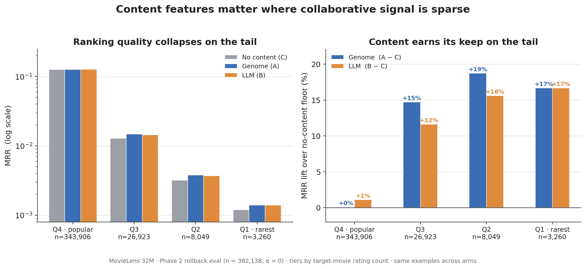

# Your Recommender Needs Content Features. Build the MovieLens Genome, or Ask an LLM?

*A controlled two-tower ablation on MovieLens 32M — and the build-vs-build decision behind it.*

## TL;DR

Every recommender needs a dense content vector per item. The gold-standard option — MovieLens's hand-curated **tag genome** — takes a mature community folksonomy plus specialist research, and produces nothing for a brand-new item. The feasible option — scrape the item's text and **extract structured features with an LLM** — needs only the item's own synopsis. In a matched A/B/C ablation (same two-tower model, same training, only the content slot changes), the LLM features **match genome on the long tail and edge it overall** (MRR 0.1157 vs 0.1146). The interesting result isn't that the LLM wins by a hair — it's that the *feasible* option is good enough to matter.

## 1. The content-feature problem, and the two ways to solve it

A two-tower recommender represents each item as an embedding. Collaborative signal — who watched what — carries most of the weight for popular items, but it runs dry exactly where you need help: the long tail, and brand-new items nobody has interacted with yet. That's what a **content vector** is for — a dense, per-item descriptor of what the item *is*, independent of who has touched it. The question is where it comes from.

**Option 1 — the genome.** The MovieLens **tag genome** is the gold standard: a dense matrix of `rel(movie, tag) ∈ [0,1]` — **1,128 tags × 16,376 movies (≈18M scores)** in this project's MovieLens 32M data (9,734 movies in GroupLens's original 2014 release), with every cell populated. But note that **16,376**: it's all GroupLens ever scored — only **~19% of MovieLens 32M's 87,585 titles**. The genome simply does not exist for the sparser ~71k (a structural limit we return to in §7); it is dense *within* its coverage but covers only the well-tagged head. And the part most people get wrong: it was built **not** by mass human labeling, but from a small **50,203-judgment survey of 676 volunteers** (1–5 scale; a fraction of a percent of the matrix; plus an 85-user pilot), with the rest filled by machine learning (a `glmer` regression, MAE 0.211) over features mined from a **large pre-existing folksonomy** — 186,000 users, 17M ratings, 246,000 tag applications accrued since 1997 — plus crawled IMDb reviews. The expensive part was never the labeling; it was owning fifteen years of community data first.

**Option 2 — LLM extraction.** Scrape the item's public text (TMDB synopsis, cast, Wikipedia plot) and ask an LLM to score it against a fixed tag taxonomy, with structured (JSON-schema) output. The content vector falls out of the item's own description.

**The catch that sets up the experiment.** The genome's inputs — a mature folksonomy, crawled reviews, a relevance survey — are exactly what a growing company *doesn't* have, and they're all zero for an item added a minute ago. So the honest question isn't "which is better in the abstract." It's: **the LLM path is the one most teams can actually take — is its content quality good enough?**

## 2. Why it's a fair fight

To compare content *sources* and nothing else, everything else is held fixed: the same two-tower architecture, the same training recipe, the same evaluation, and — critically — **Menon popularity-correction α = 0** for every arm, so no popularity debiasing confounds the comparison. Only the content slot changes:

- **A — genome:** the 1,128-dim genome scores fill the content tower.
- **B — LLM:** 132 LLM-extracted dims fill it instead.
- **C — none:** the content slot is removed entirely — the **floor**, what the model scores on its ID-embedding history pools, genre, tags, and year alone.

One more rigor move: the LLM schema is **derived from genome's own top-discriminability tags**, not hand-invented. Both spaces measure the *same axes* — otherwise "LLM ≈ genome" would be unmeasurable. (132 dims, each recorded with its source genome tag in `data/llm_schema_dimensions.json`.)

**Where this sits.** Manufacturing item features with an LLM isn't new — it's an active 2023–25 direction (KAR, ONCE/GENRE at WSDM '24, LLMRec, RLMRec all feed LLM-derived signal into recommenders, KAR with a reported production A/B gain at Huawei). What's new here is the *comparand*: rather than scoring LLM features against a weak or absent baseline, this pits them head-to-head against the **gold-standard human-curated genome, on the same axes**, with a no-content floor (C) to calibrate the lift. The question isn't "do LLM features help" — it's "how close to hand-curation does the feasible option get."

## 3. The cheap pipeline

For each of the ~9,375 corpus movies (9,366 scraped successfully): pull TMDB first — overview, tagline, genres, top-billed cast, director, writers, keywords — supplemented by Wikipedia plot and **factual** prestige indicators (Oscar wins/noms, Criterion status, box-office scale). Then run **six grouped structured-output extraction calls** — themes, tone, setting/era, provenance/structure, factual reception/prestige, visual medium — ~20–30 dimensions each, every call enforced by a JSON schema. Grouping is deliberate: a single 130-dim prompt hits "lost in the middle" and defaults late dimensions to 0.5; six focused calls don't.

Honest design calls are baked in. Structured output is non-negotiable — free-form silently corrupts the tensor. The visual and prestige groups are **factual-only**: animation, black-and-white, Oscar-winner, yes; "visually stunning" hallucinated from a synopsis, no. Reception/prestige is its own group so it can be ablated separately. The extractor was **Claude Sonnet via Claude Code**.

## 4. Does it work?

The pilot (Phase 1) ran the whole pipeline on the 4,461 popular movies (>1,000 ratings); the full run (Phase 2) added the long tail and retrained all three arms fresh on the full corpus. That corpus is **9,375 movies — already a heavily filtered slice of MovieLens 32M's 87,585 titles**, keeping only movies with more than 200 ratings (~11% of the catalog). Phase 2 is the real test — it has the tail, where content features earn their keep. Canonical eval: rollback protocol, all 19,134 validation users, **n = 382,138** rollback examples (random Hit@250 baseline = 2.7%, so these models are doing real work).

**Phase 2, whole corpus:**

| Metric | C (none) | A (genome) | B (LLM) |
|---|---|---|---|
| Hit@5 | 0.1536 | 0.1538 | **0.1552** |
| Hit@10 | 0.2213 | 0.2229 | **0.2240** |
| Hit@50 | 0.4611 | 0.4642 | **0.4656** |
| NDCG@10 | 0.1283 | 0.1288 | **0.1300** |
| MRR | 0.1143 | 0.1146 | **0.1157** |

**B leads every metric.** B−A = +0.0011 MRR (+0.97%); B−C = +0.0014 (+1.2%). The aggregate lift over the floor looks small — but that's an artifact of the target distribution: 90% of rollback targets are popular (Q4) movies where collaborative signal already dominates. The content story lives in the tail.

**MRR by popularity tier:**

| Tier (n) | C | A | B | B−A |
|---|---|---|---|---|
| Q4 popular (343,906) | 0.1259 | 0.1260 | **0.1273** | +0.0013 |
| Q3 mid (26,923) | 0.0129 | **0.0148** | 0.0144 | −0.0004 |
| TAIL ≤1k (12,652) | 0.0028 | **0.0033** | 0.0032 | −0.0001 |

*Figure 1. Left: MRR by popularity quartile (log scale) — ranking quality drops ~100× from the popular head to the rarest tier, because collaborative signal thins out. Right: relative MRR lift over the no-content floor (C) — content adds ~0% on popular movies but +12–19% on the rare tiers, and the LLM (B) tracks the genome (A) rather than collapsing.*

Three things to read off this:

1. **Content earns its keep on the tail.** The Hit@250 lift over the floor (A−C) is ~0 on Q4 but **+0.0125 on the tail** — a relative MRR lift of roughly +18%. Both content sources help exactly where collaborative filtering is starved — the story Phase 1 structurally couldn't tell.
2. **B beats A overall, driven by the popular head.** Q4 is 90% of examples and carries B−A ≈ +0.0013 stably across K; the whole-corpus number is essentially the Q4 result.
3. **The LLM does *not* collapse on rare movies.** On the deep tail (Q1, TAIL) A and B are statistically tied — MRR gaps ≤ 0.0001, which should be read as ties, not rankings. Even where content matters most, LLM features hold even with the human-curated genome. *That* is the consequential result for "can LLMs replace human curation."

Genome keeps one consistent edge: the **mid-tail (Q3)**, ~2–5% relative across K — "moderately popular" movies, not cold-start.

**A methodological aside worth the paper.** The headline verdict flipped on checkpoint selection. Selecting at minimum validation *loss* (a ranking surrogate), genome nominally led B by +0.0004 MRR. Selecting at maximum validation *MRR* — the metric we actually report — **B led A by +0.0014**. The loss surrogate differentially penalized the LLM model (its min-loss checkpoint sat well off its max-MRR one). The lesson: your model-selection metric must match your evaluation metric, or the surrogate can reverse a close comparison. (On Phase 1's popular split the same correction moved B from a tie to a clear +3.0% lift over the floor and B ahead of A.)

## 5. Why it works — what each source actually knows

Because both spaces sit on the same axes, we can correlate them directly. For each of the 132 LLM dims, the Pearson r against its mapped genome tag(s), across all 9,375 movies:

**Mean r = 0.598, median 0.608; 99 of 132 dims at r ≥ 0.5, none below 0.1.** The two are measuring the same thing. By group: visual **0.70**, setting 0.68, provenance 0.64 agree highest; themes and tone 0.56; **reception lowest at 0.42**.

- **Best axes (factual):** vampires 0.94, documentary 0.89, animated/anime 0.88, western 0.86, WWII 0.86, time-travel 0.85.
- **Worst axes (crowd-sentiment):** imdb_top_250 **0.16**, criterion **0.18**, palme_dor 0.27.

*Figure 2. Per-dimension agreement between each LLM feature and its source genome tag, across all 9,375 movies (mean r = 0.60; 99 of 132 dims at r ≥ 0.5, none below 0.1). Agreement is highest on factual axes — genre, era, medium — and lowest on crowd-prestige axes (imdb top 250, criterion): exactly the slice an LLM can't read from a synopsis.*

That split *is* the mechanism. The LLM reproduces nearly all of genome's signal on the axes it can reach from text — genre, setting, provenance, factual medium — which is why B matches A on the bulk metrics. Genome's residual advantage is concentrated precisely where agreement is lowest: **crowd-prestige** ("masterpiece," "imdb top 250"), **fine niche sub-genre** granularity (*The Good, the Bad and the Ugly*: genome's "spaghetti western" + "ennio morricone" vs the LLM's coarser "western"), and **subjective aesthetics**. The LLM, in turn, contributes clean plot facts genome buries — "artificial_intelligence" for *2001*, "based_on_book" for *Die Hard*, "hitman"/"conspiracy" for *Sicario*.

**Qualitative color (seed-dependent — not a headline).** Top-10s for canary personas show the two sources give the model different *personalities*: genome leans niche-canon-pure (tight Western, slow-burn Arthouse, cerebral Sci-Fi), the LLM leans era- and modern-subgenre matching (2000s-gore Horror, 2010s gritty Crime) but drifts to blockbusters more readily on niche genres. Five illustrative disagreements:

| Persona | Genome (A) leans | LLM (B) leans |
|---|---|---|
| Sci-Fi | cerebral — Brazil, Gattaca, Forbidden Planet | popcorn — Fifth Element, T2, Total Recall |
| Crime | drifts to finance — Big Short, Margin Call | nails gritty — Sicario 2, Hell or High Water |
| Western | tight canon — Searchers, Rio Bravo | drifts to war epics — Patton, Braveheart |
| Arthouse | slow-burn — Stalker, In the Mood for Love | prestige — Fight Club, American Beauty |
| Horror | 90s slashers — Scream 2/3, Ring | 2000s gore — Saw II/IV/V, House of Wax |

Treat this strictly as color. A later tuning pass found the original Horror seeds were a weak, incoherent taste profile that *manufactured* apparent drift — strengthening them made every arm recommend 100% on-genre. The quantitative tier metrics, not the canary, carry the conclusion.

## 6. The payoff: feasibility, speed, cost

Here's where "good enough" cashes out. The point was never that the LLM features are 1% better — it's that they're the option a real team can actually build. Dimension by dimension (every replication dollar figure below is a labeled **estimate** — the genome papers publish none):

| Dimension | Genome (GroupLens) | LLM extraction (this repo) |
|---|---|---|
| Human labeling | 50,203 judgments (676 volunteers); **~$5k–23k (central ~$10k)** to buy as crowd labor today *(est)* | **Zero** |
| Binding prerequisite | A ~15-year folksonomy (186k users / 17M ratings / 246k tag applications, since 1997) + crawled IMDb reviews — accrues with usage, not buyable quickly | The item's own text — exists day one |
| Specialist engineering | LSI/SVD features + rating-affinity + text-mining + a 6-model regression bake-off; **weeks–months** *(est)* | Scraper + schema derivation + 6 grouped prompts; **a few engineer-days** |
| Direct $ (this corpus) | ~$10k survey + tens of $k labor, *only if you already own the folksonomy*; **~$85–210k** to hand-curate without one *(est)* | **~$0 marginal as run**; **~$170–220** if reproduced on the metered API (Sonnet $3/$15) |
| Time-to-first-vector, new item | Effectively **never** until the crowd tags it | **Sub-hour**, zero-shot from text |
| Maintenance / new domain | Re-survey + re-crawl + re-train; new domain = redo everything | Parallel API calls per item |
| Quality (this ablation) | A: MRR 0.1146 | B: **0.1157** — matches/edges genome |

Three legs:

1. **Feasibility / build-vs-build.** The genome needs a mature folksonomy + specialist research; the LLM needs only item text. The LLM side is cheap but **not "$0"** — full-corpus extraction consumed ~84% of one week's Sonnet quota on a Claude Max plan (≈$0 marginal under the subscription; ~$170–220 if reproduced on the metered API). Direct-dollar savings run roughly 1–3 orders of magnitude — but the durable claim is **feasibility, not price**: for a company without a folksonomy, the genome path isn't expensive, it's *unavailable*.
2. **Speed / cold-start.** Time-to-first-content-vector for a brand-new item: **sub-hour** (scrape + six calls) versus the genome's **effectively never** — its input features are all zero until the crowd tags the item.
3. **Cold-start bootstrapping (enabled-by, *not measured here*).** A sub-hour content vector lets you compute content-space nearest neighbors and seed a new item into the traffic of users who already get its most-similar items — warming up its collaborative embedding on far fewer impressions (cf. DropoutNet, NeurIPS 2017). This experiment didn't build or measure that; but it validates the premise it rests on — the r≈0.60 agreement and the Toy Story / Godfather similarity checks show the content NN is meaningful. Mind the axis, though: NN-seeding is a *rich-content-vs-no-content* benefit, so genome enables it too; it's **LLM-specific only at true cold start**, where genome doesn't exist to NN on in the first place.

**"Neural ≠ cheaper" sidebar.** The 2021 genome refresh (TagDL, a PyTorch MLP) bought ~2.6% MAE and changed *none* of the data prerequisites — same survey, same folksonomy. And the genome team's own 2026 cross-domain paper hit exactly the prerequisite wall extending to Amazon — *"the absence of … item-tag ratings and tag applications"* — had to reuse old survey labels, and took a measured accuracy hit. The strongest evidence that the prerequisite is binding comes from the people who built the genome.

## 7. What genome still wins — and limitations

Genome isn't beaten; it's matched on what an LLM can read from text and still ahead where it can't. It keeps the **crowd-sentiment** slice ("masterpiece," "great acting" — pure community judgment, r≈0.16–0.18 with any LLM proxy), the **fine-aesthetic / niche-sub-genre** granularity that wins the Western and Arthouse canon, and a small, consistent **mid-tail (Q3)** edge.

Limitations, stated plainly:

- **Two separate filterings, easy to conflate — and we filtered neither of the genome ones.** *(1) Our corpus:* all three arms train and evaluate on the **9,375 movies with more than 200 ratings** — *our* cutoff on MovieLens 32M's **87,585** titles, chosen for clean collaborative signal and tractable extraction. Both sources fully cover it (the genome scores all 9,375), so the head-to-head is scale-matched and fair, and the §6 cost lines compare like for like. *(2) The genome's own ceiling:* **GroupLens never published genome scores for all 87,585 titles** — the file we downloaded from them covers exactly **16,376 movies (~19% of the catalog)**, and that limit is *theirs*, not our doing: the other **71,209 (~81%)** are too sparsely tagged and rated for their model to score at all. So the eval — restricted to the popular 9,375 that *both* sources cover well — can't even see the gap that matters most: across ~81% of the catalog the genome simply **does not exist**, while the LLM produces a vector for any title from its text alone (~$1.6–2k metered for the whole catalog, *est*). And even the "TAIL ≤1k" tier above is movies with 200–1,000 ratings, *not* genuine cold-start. So the offline numbers almost certainly **understate** the real-world feasibility gap.
- **Single LLM.** Claude Sonnet only, no cheaper-model bake-off. This supports "Sonnet-class extraction matches genome," **not** "any cheap model would."
- **Cost is amortized, not zero.** The ~$0 is *marginal dollars* under a flat-rate subscription, not a per-call API figure.
- **Reception asymmetry.** Pure-sentiment genome tags ("masterpiece," "predictable," "overrated") can't be made factual and remain a genome-only advantage.
- **Prestige-as-popularity leakage.** Scraped box-office / IMDb-rating in the reception group are quasi-popularity signals, in mild tension with the α=0 "no popularity" stance — which is why that group is separately ablatable.
- **Possible training-data contamination.** The LLM may have seen MovieLens-adjacent discussion in pretraining.
- **Canary is seed-dependent** qualitative color, not a finding; the tier metrics carry the headline.

## 8. Does combining both help? (Model D — a side question)

Stacking both sources in one model (D, two parallel content towers) answers a *different* question — "does *more* help?" — and the answer is **no clear additive benefit.** On top-rank metrics D ≈ B, the better single source (MRR 0.1154 vs B's 0.1157), consistent with the r≈0.60 redundancy: there's little independent signal to stack. The lone gain is a small deep-tail recall bump (Hit@250 best in three of four tail tiers). D also *regresses* on the Western canary, diluting genome's niche pull. At α=0, D is not a clear upgrade over either single source. *(Deployment note: the model actually shipped is a separate α=0.5 fine-tune of the D architecture — a portfolio-motivated "one deployed model fuses the curated genome with my own scraped + LLM-extracted features" decision, verified on par with the prior genome-only prod, not pitched as a metrics upgrade.)*

## 9. Takeaway

For a team without a pre-existing folksonomy — which is most teams, and every new product — **LLM extraction is the pragmatic default**, and it recovers nearly all of the genome's content signal on the axes reachable from text. The residual genome edge is the crowd-sentiment / fine-aesthetic slice you only get from a community you may not have.

The deeper point: the genome and the LLM are two generations of the *same idea* — propagate a dense content matrix from cheap signals. GroupLens propagated a 50,000-judgment survey across millions of (movie, tag) cells with regression, standing on fifteen years of community data. The LLM generation propagates from the item's own text — and in doing so removes the community, the folksonomy dependence, and the cold-start wall. It trades a thin slice of crowd-curated nuance for the ability to run on day one, for any item, at any company. For the content-feature problem most teams actually have, that's the trade you want.

---

*Provenance: results from the Phase 2 canonical eval (rollback protocol, all 19,134 val users, n=382,138) — `eval_results/best_softmax_{genome_tags,llm_features,}_popularity_alpha_0_*.txt`; feature-level agreement from `llm_features/feature_level_analysis.py` over `data/llm_schema_dimensions.json`; genome construction facts grounded to Vig, Sen & Riedl (2010 GroupLens tech report + ACM TiiS 2012) and the tag-genome README, with the 2026 cost/feasibility sweep (TagDL SIGIR '21, book genome CHIIR '22, cross-domain CHIIR '26; MTurk/Prolific + Pandora cost anchors) folded into `docs/movielens_genome_features_info.md`. Every replication dollar figure is a labeled estimate; the genome papers report none. Drafted from `docs/plans/llm_vs_genome_writeup_outline.md`.*

*Figures generated by `llm_features/make_figures.py` (into the gitignored `results/figures/`) and committed for this writeup to `docs/figures/`, alongside `feature_agreement_r.json` — the cached 132 per-dimension correlations behind Figure 2.*
