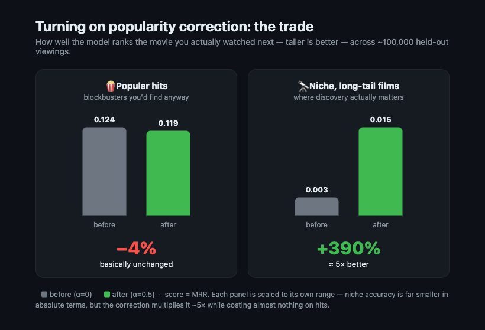
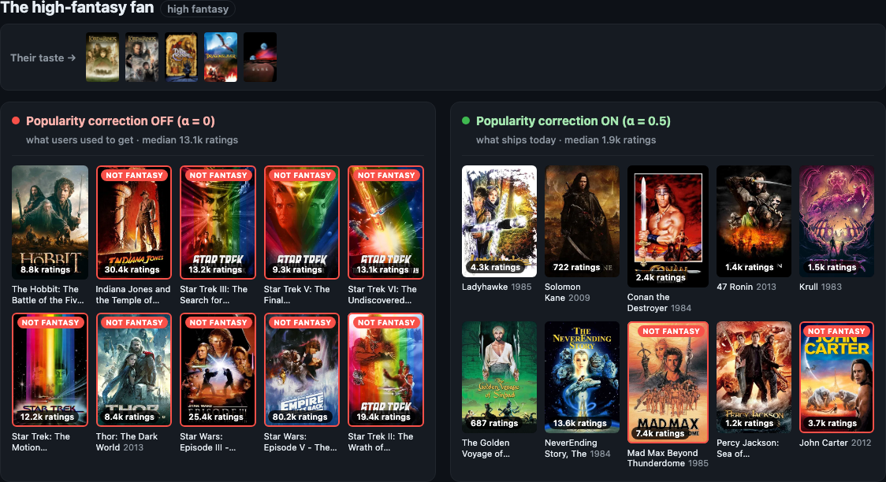
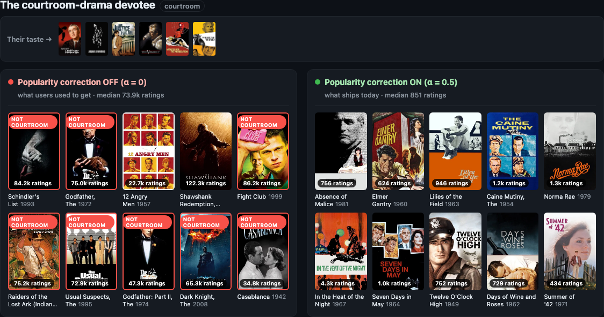
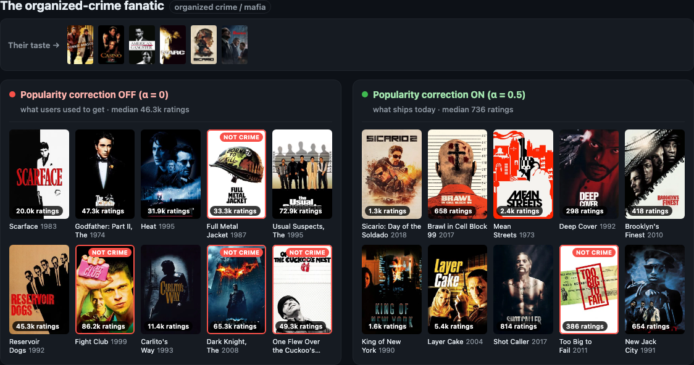
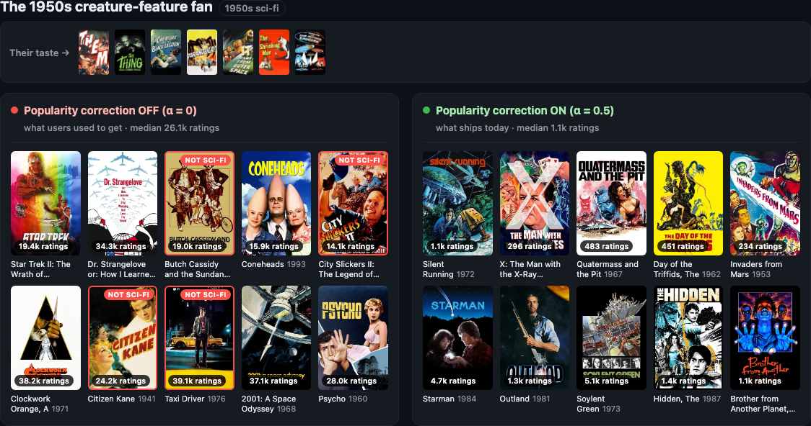
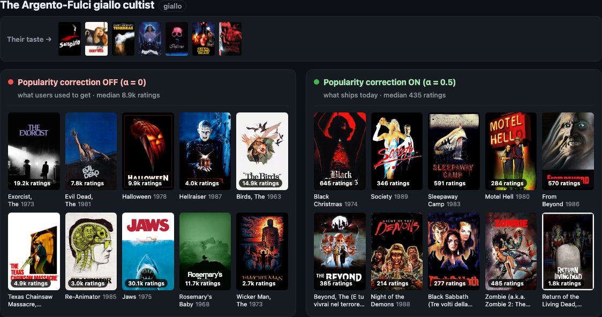
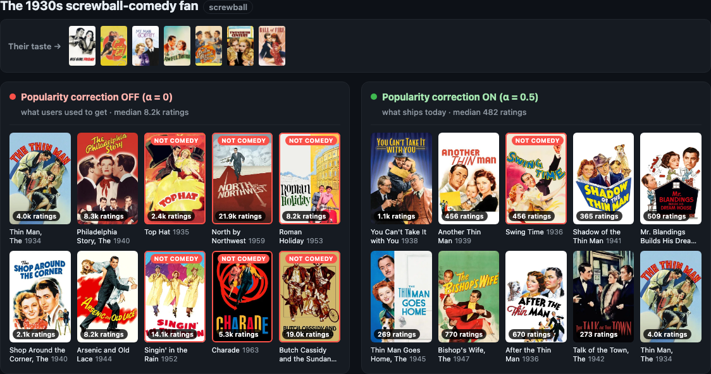

# Taming popularity bias in recommender systems with logit adjustment

*How a single scalar in the loss function got my recommender surfacing the niche films users actually want (instead of always showing blockbusters) — with zero added latency.*

---

Picture a die-hard **WW2 movie buff**. Their watchlist is *Saving Private Ryan*, *Enemy at the Gates*, *Stalingrad*, *The Great Escape*. You ask the recommender: what next?

Here's what my two-tower model returned — **the same user, the same architecture, the same code path — for two versions that differ by exactly one number in the training loss:**


*(Interactive version: `poster_board.html` — posters load live from TMDB.)*

Look at the left wall (the "before"). For a *WW2* fan, the model serves up **Braveheart** (medieval Scotland), **Gladiator** (ancient Rome), **The Lord of the Rings — twice** (Middle-earth), and **The Godfather Part II** (the Mob). **Six of the ten aren't even war movies.** What they *are* is **massively popular** — Braveheart alone has **75,514 ratings**. The model didn't recommend war films. It recommended *famous* films and hoped you wouldn't notice.

Now the right wall (the "after"). **The Devil's Brigade. Cross of Iron. Tora! Tora! Tora! Battle of Britain.** Actual war films — most with **a few hundred ratings**, the kind of catalog depth a real enthusiast actually wants. The median recommendation went from **35,547 ratings to 1,083** — roughly **33× less mainstream — and it got *more* on-genre, not less.**

This isn't a WW2 quirk — the same before/after holds for *every* taste I tried. See **six more fans** — high-fantasy, crime, courtroom, vintage sci-fi, giallo horror, and screwball comedy — in the **[Appendix](#appendix-more-examples)** (the courtroom fan's "before" wall is, almost comically, the literal IMDb Top 10).

## What's actually going wrong here

This is **popularity bias**, and it's a feedback loop, not a bug:

1. Popular movies get shown more, so they collect more clicks.
2. You train on those clicks, so the model learns *"popular = good."*
3. The model shows popular movies even more. **Go to step 1.**

Left alone, your "personalized" recommender slowly collapses into a **Trending shelf** — it hands everyone the same blockbusters and quietly buries the entire long tail of the catalog. Which, for a business, is the half of your inventory you paid to license and now never show anyone.

## The fix is one line — and it's free at serving time

This comes straight from a 2020 paper, **["Long-Tail Learning via Logit Adjustment" (Menon et al.)](https://arxiv.org/abs/2007.07314)**. The idea is almost suspiciously simple:

**During training, add a bonus to every movie's score equal to how popular it is — including every wrong answer.**

```python
# during training only: add each movie's log-popularity to its score
scores = user · movie_embeddings  +  α · log(1 + rating_count)
```

The beautiful part for anyone who's shipped models: **the serving code never changes.** The correction lives entirely in training. Inference is still one dot product — **zero extra lookups, zero added latency.** In fact, my live demo ships *both* trained models behind a single toggle, and flipping it just swaps which weights you score against. The "before/after" walls above? That's literally the toggle.

The strength is one knob, **α**. At `α=0` you get the blockbuster wall. Crank it too high and you over-correct into pure obscurity. I tuned it to **`α=0.5`** — enough to fix the drift, not so much that *Saving Private Ryan* never shows up.

## How it works

**Why does *adding* a popularity bonus *reduce* popularity bias?** The model trains as a full softmax: each example scores the true next movie against *every* movie in the catalog, and the bonus `α · log(popularity)` is added to *all* of them. So in every training step, popular movies sit among the negatives **with a head start**. The model can only drive the loss down by scoring the *true* movie high enough to **beat those boosted popular negatives** — it's forced to clear a higher bar specifically against popular titles. Repeat over millions of examples and the model learns scores that encode **relevance net of popularity**: a movie ranks high only when you'd like it *more than its raw popularity already predicts*. At serving you drop the bonus and rank on those scores — so a niche film you're a perfect match for can finally outrank a blockbuster everyone half-watches.

> *For the math-inclined:* the objective's optimum drives each raw score toward `log P(movie | you) − α · log(popularity)` — contextual relevance with the base rate divided back out. The bonus exists **only** in training; at serving you rank on the raw score, which has already absorbed that popularity discount. It's the Fisher-consistent result from the paper, not a heuristic.

## Why this beats the usual post-ranking hacks

Most teams fight popularity bias **after** the model — demotion multipliers, per-page blockbuster caps, a bolted-on diversity re-ranker — heuristics nobody fully trusts that rot as the catalog shifts and add a stage to the serving path. Logit adjustment is the opposite: **one line** in the loss, **mathematically grounded** (the Fisher-consistent term from the box above, not an eyeballed constant), and **trivial to maintain** — the whole behavior is one hyperparameter you re-tune in the next retrain if a PM finds the debiasing too aggressive.

It's not even two-tower-specific: the correction lives in the softmax, so it drops into *any* model trained with cross-entropy over candidate items — **ranking models included.**

## Does it hold up beyond a couple of cherry-picked fans?

I ran both models over **60,000 held-out recommendation contexts** from 3,000 real users and measured the popularity of what they actually served:

| | Before (α=0) | After (α=0.5) | |
|---|---:|---:|---|
| **Median recommendation popularity** | 26,830 ratings | **13,200** | **↓ 51%** |
| **Catalog coverage** (distinct films ever shown) | 4,485 (48%) | **7,899 (84%)** | **+3,414 movies** |
| **Exposure inequality** (Gini) | 0.907 | **0.776** | more equal |
| **Long-tail share of recommendations** | 0.2% | **4.3%** | **~20×** |

The median recommendation got **half as mainstream**, and the model went from surfacing **48% of the catalog to 84%** — 3,400+ movies that previously had *zero* chance of being recommended to anyone.

## So what's the catch? (there's always a catch)



Demoting popular titles isn't free, and any honest writeup has to show the bill. Held-out viewings skew popular — that's literally what popularity bias *is* — so when you down-weight popular movies, some of those held-out favorites get ranked a notch lower. Across the **same ~100,000 held-out viewings**, scored by both models:

| Overall ranking accuracy | α=0 | α=0.5 | |
|---|---:|---:|---|
| **MRR** | 0.120 | 0.115 | −4.3% |
| **Recall@10** | 0.230 | 0.220 | −4.4% |
| **NDCG@10** | 0.135 | 0.129 | −4.1% |

About **4% off the top line.** Real — but look at *where* the bill is paid:

| MRR, split by how popular the held-out movie was | α=0 | α=0.5 | |
|---|---:|---:|---|
| **Popular head** (>1,000 ratings) | 0.124 | 0.119 | −4.7% |
| **Long tail** (≤1,000 ratings) | 0.0031 | 0.0152 | **+390%** |

**The entire cost lands on the popular head** — the blockbusters the model already nails and that barely need a recommender to be found. Meanwhile the **long tail gets 5–12× more accurate** (tail Recall@10 climbs from 0.2% to 3%): still hard in absolute terms, but no longer hopeless — and that's exactly the region where a recommender earns its keep.

So the honest trade is: **give up ~4% accuracy on movies everyone already knows, to make the other 84% of the catalog findable at all.** For a discovery product, you take that trade every time. And because `α` is a dial, not a switch, you choose *exactly* how much head-accuracy you're willing to spend.

## The takeaway

Most "fix the recommender" projects mean a bigger model, more features, more compute. This one was **a single term in a loss function**, grounded in a clean piece of theory, that:

- **halved** the popularity of recommendations,
- nearly **doubled** catalog coverage,
- made the long tail **5–12× more findable**,
- cost ~4% head-accuracy and **zero** added latency, and
- ships as a **toggle you can flip in the live demo**.

## Appendix: More examples

Same two models, same toggle — a different taste. A **high-fantasy fan** (seeded on *The Lord of the Rings*, *The Dark Crystal*, *Dragonslayer*, and *Dune*) tells the same story even louder: at "before," **9 of 10 picks are Star Trek, Star Wars, Thor, and Indiana Jones** — sci-fi blockbusters, not a single sword in sight. At "after," it's *Ladyhawke, Krull, The NeverEnding Story, Conan* — the genre the user actually asked for.



And the same one-line toggle holds across five more tastes — crime, courtroom, vintage sci-fi, horror, and classic comedy. Every "before" wall is the same handful of blockbusters everyone's already seen; every "after" wall is the catalog that fan was actually asking for.

**The courtroom-drama fan** (*12 Angry Men*, *Anatomy of a Murder*, *The Verdict*) gives the most violent swing of all. At "before," the model serves the all-time-famous shelf — *The Shawshank Redemption* (122k ratings), *Schindler's List*, *The Godfather*, *Casablanca*, *Raiders of the Lost Ark* — almost none of them courtroom films. At "after," it finds the mid-century legal and social dramas the fan actually wants: *In the Heat of the Night*, *The Caine Mutiny*, *Seven Days in May*, *Norma Rae*. Median recommendation popularity: **73,948 → 851 ratings — 87× less mainstream.**



**The organized-crime fan** (*Donnie Brasco*, *Casino*, *American Gangster*) gets handed the most famous "dark serious" movies ever made — *Fight Club*, *The Dark Knight*, *The Godfather Part II*, *Reservoir Dogs* — several of them not even crime films. At "after," the genuine deep catalog: *Mean Streets*, *King of New York*, *Deep Cover*, *New Jack City*. **46,294 → 736 ratings (63×).**



**The 1950s creature-feature fan** (*Them!*, *Tarantula*, *Creature from the Black Lagoon*) gets the art-house syllabus at "before" — *2001*, *Psycho*, *Taxi Driver*, *Citizen Kane*, *A Clockwork Orange* — prestige cinema, not a rubber monster in sight. At "after," the actual drive-in canon: *The Day of the Triffids*, *Quatermass and the Pit*, *Invaders from Mars*, *Soylent Green*. **26,087 → 1,137 ratings (23×).**



**The Argento-Fulci giallo cultist** (*Suspiria*, *Deep Red*, *Tenebre*) is offered the famous-horror starter pack at "before" — *The Exorcist*, *Jaws*, *Halloween*, *Rosemary's Baby*. At "after," it descends into the Italian and cult underground: *The Beyond*, *Black Sabbath*, *Zombie*, *Black Christmas*. **8,884 → 435 ratings (20×).**



**The 1930s screwball-comedy fan** (*His Girl Friday*, *The Lady Eve*, *My Man Godfrey*) drifts at "before" to famous classics that aren't screwball at all — *North by Northwest*, *Singin' in the Rain*, *Butch Cassidy and the Sundance Kid*. At "after," the deep pre-war comedy shelf: *The Thin Man* and its sequels, *Talk of the Town*, *You Can't Take It with You*. **8,195 → 482 ratings (17×).**


